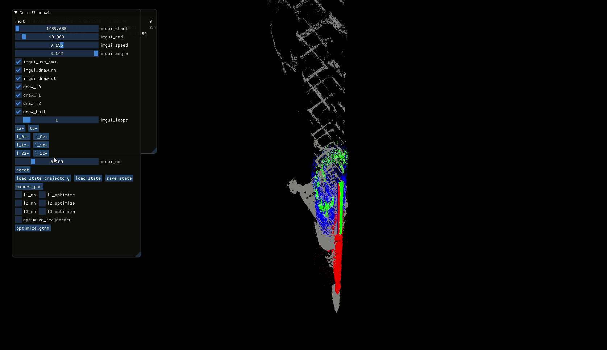

# Visualizing bag files

Files can be visualized using RViz, we provide custom, updated calibration to overide deafult one from rosbag.

Sample of usage:
In first terminal start roscore
```
rosparam set use_sim_time true
roscore
```
In second terminal start broadcasting new calibration and play bags files:
```
python mine-mapping-dataset/visualization/publish_custom_calibration.py &
rosbag play day1/mine_mapping_trajectory.bag day1/mine_mapping_0**.bag --clock -s 200 tf_static:=old_tf_static
```
In the third terminal open rviz:
```
rviz -d mine-mapping-dataset/visualization/config.rviz
```
Expected results:

[](https://www.youtube.com/watch?v=A6Is-ao9THQ "YouTube")

[Youtube video](https://www.youtube.com/watch?v=A6Is-ao9THQ)

# Extrinisic calibration - experimental

Tool allow to register mapping system to ground truth data, and optimize extrinics parameters of LiDAR.
Can be used also to provide sample data for further analysis. 
```
extrinsic_calibration/extrinsic_calibration --gt /home/michal/analysis/fused_local.pcd \\
--json /home/michal/analysis/site_1/site.json  \\
--bags bags/day2/Day2_2021-10-30-10-51-12_21.bag \\
--bags bags/day2/Day2_2021-10-30-10-52-12_22.bag \\
--filter 0.2
```
Sample analysis done with that tool can be found here : https://drive.google.com/drive/folders/12Q3tLEX47gJGWJvgLTmVs8yncQco87Rn?usp=share_link

